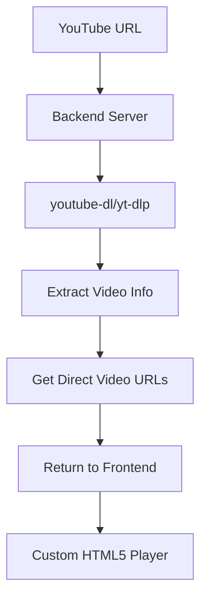

# YouTube Video Extraction Setup Guide

This guide will help you set up a backend service that can extract actual YouTube video streams and play them in your custom HTML5 video player.

## 🎯 What This Achieves

- **Real YouTube Video Extraction** - Gets actual video file URLs from YouTube
- **Custom HTML5 Player** - Plays extracted videos in your custom player
- **No Iframes** - Direct video streaming, not embedded YouTube player
- **Full Control** - Complete control over video playback and UI

## 📋 Prerequisites

- Node.js (v14 or higher)
- Python 3 (for youtube-dl)
- pip (Python package manager)

## 🚀 Setup Instructions

### Step 1: Install YouTube Extraction Tools

```bash
# Install youtube-dl (original)
pip3 install youtube-dl

# OR install yt-dlp (recommended - better maintained)
pip3 install yt-dlp

# Verify installation
youtube-dl --version
# OR
yt-dlp --version
```

### Step 2: Set Up Backend Server

```bash
# Navigate to backend directory
cd backend

# Install Node.js dependencies
npm install

# Make setup script executable (Linux/Mac)
chmod +x setup.sh

# Run setup script
./setup.sh
```

### Step 3: Start the Backend Server

```bash
# Start the server
npm start

# OR for development with auto-restart
npm run dev
```

The server will start on `http://localhost:3001`

### Step 4: Test the Backend

```bash
# Test health endpoint
curl http://localhost:3001/api/health

# Test video extraction (replace with actual YouTube URL)
curl -X POST http://localhost:3001/api/extract-video \
  -H "Content-Type: application/json" \
  -d '{"url": "https://www.youtube.com/watch?v=dQw4w9WgXcQ"}'
```

## 🔧 How It Works

### 1. Video Extraction Process



### 2. Backend API Endpoints

#### `POST /api/extract-video`
Extracts video information and direct URLs from YouTube.

**Request:**
```json
{
  "url": "https://www.youtube.com/watch?v=VIDEO_ID"
}
```

**Response:**
```json
{
  "id": "VIDEO_ID",
  "title": "Video Title",
  "description": "Video Description",
  "duration": 1800,
  "thumbnail": "https://img.youtube.com/vi/VIDEO_ID/maxresdefault.jpg",
  "streams": [
    {
      "url": "https://direct-video-url.com/video.mp4",
      "quality": "720p",
      "format": "mp4",
      "size": 50000000
    }
  ],
  "isYouTube": true
}
```

#### `GET /api/health`
Health check endpoint.

**Response:**
```json
{
  "status": "OK",
  "message": "Video extraction service is running"
}
```

## 🎮 Frontend Integration

The frontend automatically:

1. **Detects YouTube URLs** - Identifies YouTube video links
2. **Calls Backend API** - Requests video extraction
3. **Gets Direct URLs** - Receives actual video file URLs
4. **Plays in Custom Player** - Uses HTML5 video element with custom controls
5. **Falls Back Gracefully** - Uses YouTube embed if extraction fails

## 🛠️ Troubleshooting

### Common Issues

#### 1. youtube-dl Not Found
```bash
# Make sure youtube-dl is in PATH
which youtube-dl

# If not found, install globally
pip3 install --user youtube-dl
```

#### 2. CORS Errors
The backend includes CORS headers, but if you encounter issues:
```javascript
// In backend/server.js, update CORS settings
app.use(cors({
  origin: ['http://localhost:3000', 'http://localhost:5173'],
  credentials: true
}));
```

#### 3. Video URLs Not Working
Some video URLs may be temporary or region-restricted:
- Try different YouTube videos
- Check if the video is publicly accessible
- Some videos may have download restrictions

#### 4. Backend Connection Failed
```bash
# Check if server is running
curl http://localhost:3001/api/health

# Check server logs
npm run dev
```

### Debug Mode

Enable debug logging in the frontend:

```typescript
// In videoExtractionService.ts
console.log('Extracting video from:', youtubeUrl);
console.log('Backend response:', videoInfo);
```

## 🔒 Security Considerations

### Production Deployment

1. **Rate Limiting** - Implement rate limiting on the backend
2. **Authentication** - Add API key authentication
3. **CORS** - Configure proper CORS for your domain
4. **HTTPS** - Use HTTPS in production
5. **Error Handling** - Don't expose sensitive error details

### Example Production Setup

```javascript
// Add rate limiting
const rateLimit = require('express-rate-limit');

const limiter = rateLimit({
  windowMs: 15 * 60 * 1000, // 15 minutes
  max: 100 // limit each IP to 100 requests per windowMs
});

app.use('/api/', limiter);
```

## 🚀 Advanced Features

### 1. Quality Selection

The backend returns multiple quality options. You can implement quality selection:

```typescript
// Get different quality streams
const videoInfo = await videoExtractionService.extractVideoInfo(url);
const bestQuality = videoInfo.streams.find(s => s.quality === '1080p');
const mediumQuality = videoInfo.streams.find(s => s.quality === '720p');
```

### 2. Progress Tracking

Track video progress and save to database:

```typescript
onTimeUpdate={(currentTime, duration) => {
  const progress = (currentTime / duration) * 100;
  // Save to database
  saveVideoProgress(videoId, progress);
}}
```

### 3. Caching

Implement caching to avoid repeated extractions:

```javascript
// In backend/server.js
const cache = new Map();

app.post('/api/extract-video', async (req, res) => {
  const { url } = req.body;
  
  // Check cache first
  if (cache.has(url)) {
    return res.json(cache.get(url));
  }
  
  // Extract and cache
  const result = await extractVideo(url);
  cache.set(url, result);
  res.json(result);
});
```

## 📱 Testing

### Test with Different Videos

```bash
# Short video
curl -X POST http://localhost:3001/api/extract-video \
  -H "Content-Type: application/json" \
  -d '{"url": "https://www.youtube.com/watch?v=dQw4w9WgXcQ"}'

# Long video
curl -X POST http://localhost:3001/api/extract-video \
  -H "Content-Type: application/json" \
  -d '{"url": "https://www.youtube.com/watch?v=VIDEO_ID"}'
```

### Frontend Testing

1. Open your app in browser
2. Navigate to a course with YouTube video
3. Check browser console for extraction logs
4. Verify custom player loads with extracted video

## 🎉 Success Indicators

You'll know it's working when:

- ✅ Backend server starts without errors
- ✅ Health check returns "OK"
- ✅ Video extraction returns direct URLs
- ✅ Custom player loads YouTube video content
- ✅ No iframe, pure HTML5 video element
- ✅ Custom controls work (play, pause, seek, volume)

## 🔄 Fallback Behavior

If extraction fails, the system automatically falls back to YouTube embed, ensuring videos always play.

## 📞 Support

If you encounter issues:

1. Check backend server logs
2. Verify youtube-dl installation
3. Test with different YouTube URLs
4. Check browser console for errors
5. Ensure backend is accessible from frontend

The system is designed to be robust with multiple fallback layers, so videos will always play even if extraction fails.
